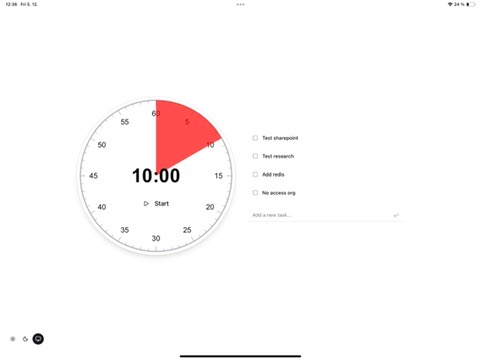
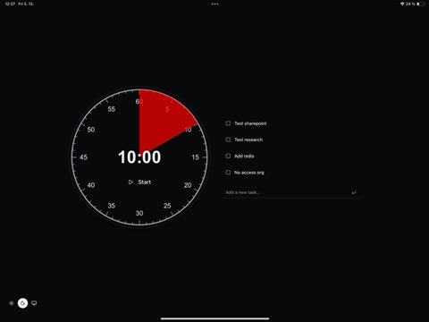
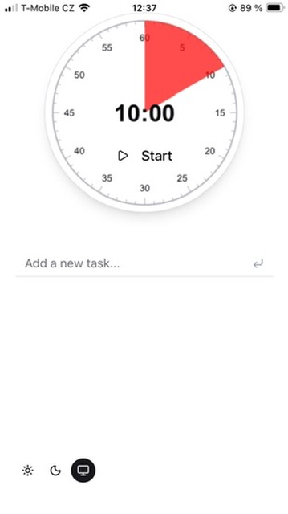

# Pomodoro Timer

A minimalist, visual pomodoro timer with task management. Built with React and designed to work seamlessly across desktop and mobile devices.



## Features

### Visual Timer
- **Analog clock interface** - Drag around the clock face to set your desired duration (1-60 minutes)
- **Real-time countdown** - Watch the red section shrink as time passes
- **Audio notification** - Get notified when your session completes

### Task Management
- **Simple todo list** - Add tasks to focus on during your pomodoro session
- **Persistent storage** - Your tasks are saved locally and persist across sessions

### Progressive Web App (PWA)
- **Install on any device** - Add to home screen on iOS, Android, or desktop
- **Works offline** - Full functionality without an internet connection
- **Fast loading** - Cached assets for instant startup

### Mobile-First Design
- **Screen wake lock** - Keeps your screen awake while the timer is running (perfect for iPad/tablet use)
- **Responsive layout** - Adapts beautifully from phone to desktop
- **Touch-friendly** - Drag to set time, tap to complete tasks
- **Dark/Light mode** - Follows your system preference or toggle manually

## Screenshots

| Dark Mode | Mobile |
|-----------|--------|
|  |  |

## Getting Started

### Prerequisites
- Node.js 18+
- pnpm

### Installation

```bash
# Clone the repository
git clone https://github.com/janostik/pomodoro.git
cd pomodoro

# Install dependencies
pnpm install

# Start development server
pnpm dev
```

### Build for Production

```bash
pnpm build
pnpm preview
```

## Tech Stack

- **React 19** - UI framework
- **TypeScript** - Type safety
- **Vite** - Build tool
- **Tailwind CSS v4** - Styling
- **Framer Motion** - Animations
- **Workbox** - PWA/Service Worker

## License

MIT

---

*This project was co-authored with [Claude](https://claude.ai).*
